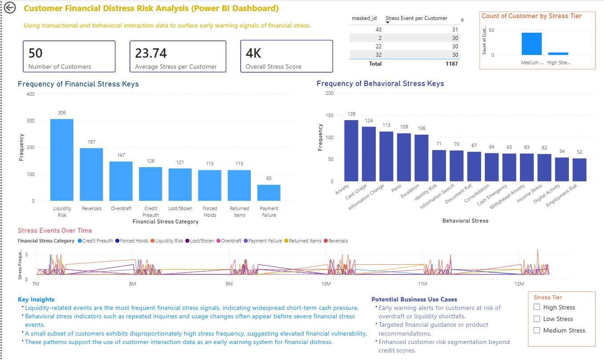

# data-analytics-portfolio
Applied data analysis portfolio showcasing data cleaning, exploratory analysis, and reporting projects using real-world datasets and business-focused questions.

## How to Use This Portfolio
Each project includes a brief problem statement, data preparation steps, analytical approach, key findings, and business-relevant insights. Dashboards and visual outputs are included where applicable.

## Core Skills
- Data cleaning and preparation
- Exploratory data analysis (EDA)
- Financial and operational analysis
- Dashboard and report creation
- Cross-functional documentation

## Tools
- Microsoft Excel
- Power BI
- Python (data cleaning & analysis)
- SQL / relational databases
- GitHub (documentation & version control)

## Featured Projects

**Customer Financial Distress Risk Analysis (Power BI)**  
Interactive dashboard analyzing financial and behavioral interaction data to surface early warning signals of customer financial stress.
1. [Financial Distress Data Analysis (2025)](https://github.com/lomsana/financial-distress-data-analysis)

## Power BI Dashboard Preview

**Customer Financial Distress Risk Analysis**
The following Power BI dashboard was built using the same dataset as *Predicting Financial Distress Using Interaction Data*.  
It provides a business-facing view of customer risk patterns, stress frequency, and behavioral indicators to support early risk identification.

🔗 [View dashboard documentation](power-bi/README.md)

   
2. [Organizational Financial Health Analysis – L’Arche USA (2022) (https://github.com/lomsana/organizational-financial-health-analysis)
   
## Supporting Projects
3. Math Modeling & Financial Analysis — Erie Arts & Culture (2020)
4. Data Analysis Training (Python) — Gannon University (2022–2023)

## Data Sources & Notes
Projects use academic, simulated, or publicly available datasets. When real organizational data was involved, sensitive information was anonymized or summarized for demonstration purposes.

## Skills Demonstrated Across Projects
- **Data Cleaning & Preparation**: Python, Excel (L’Arche USA; Data Analysis Training)
- **Exploratory Analysis**: Financial distress indicators, trend analysis
- **Dashboarding**: Power BI (Customer Financial Distress Risk Analysis)
- **Reporting & Communication**: Executive summaries, comparative analysis
